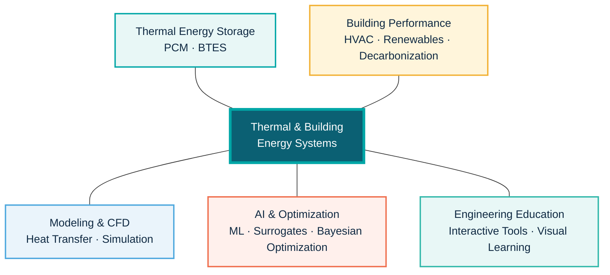

### Researcher · Educator · Engineering Tool Builder

I connect **physics-based simulation**, **thermal and building systems**, and **artificial intelligence** to create practical research and interactive engineering tools.

---

## Research Network

## Featured Research

| Research area | Focus |
|---|---|
| **AI-Guided BTES Optimization** | Combining TRNSYS simulation, machine-learning surrogates, and Bayesian optimization to improve solar-assisted borehole thermal energy storage systems |
| **PCM Thermal Energy Storage** | Numerical and experimental investigation of phase-change materials for efficient thermal storage and heat-transfer enhancement |
| **Building Performance & HVAC** | Physics-based modeling of building energy systems, HVAC performance, renewable integration, and decarbonization strategies |

## Explore My Engineering Tools

| | Tool | What it does |
|:---:|---|---|
| 🌊 | **[Indoor Pool Load Calculator](https://nuhaaljuneidi.github.io/indoor-pool-load-calculator/)** | Estimates evaporation and heating loads for indoor pools |
| 🏢 | **[Architectural Engineering Energy Tool](https://nuhaaljuneidi.github.io/AE_bill/)** | Explores building energy use and utility costs |
| 🌡️ | **[Thermal Image Explorer](https://nuhaaljuneidi.github.io/Thermal-Image/)** | Supports interactive thermal-image analysis and visualization |
| 🔥 | **[Heat Transfer Interactive Tool](https://nuhaaljuneidi.github.io/ht_interactive_tool/)** | Makes heat-transfer concepts visual and interactive |

### From simulation to insight—and from insight to usable engineering tools.

  

